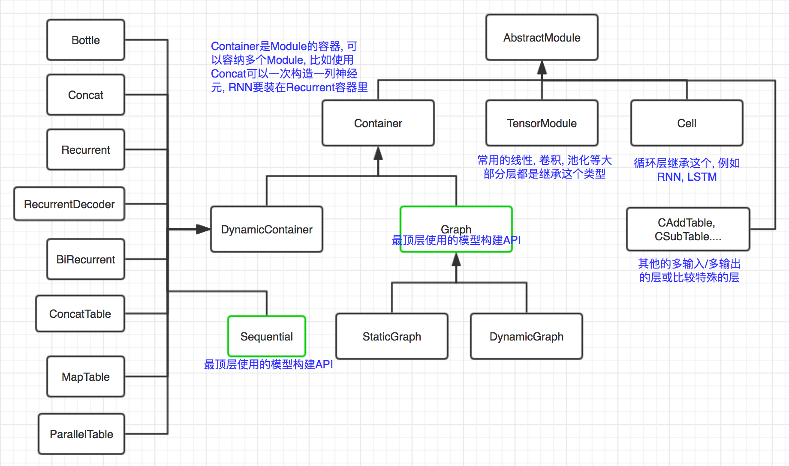

# Module
`Module`是BigDL中网络构建的基本单位，网络的每一种层都实现为一个`Module`。



## AbstractModule
`com.intel.analytics.bigdl.nn.abstractnn`包内定义了`AbstractModule`，它是所有`Module`的原始基类：
```scala
package com.intel.analytics.bigdl.nn.abstractnn
/**
 * Module is the basic component of a neural network. It forward activities and backward gradients.
 * Modules can connect to others to construct a complex neural network.
 *
 * @tparam A Input data type
 * @tparam B Output data type
 * @tparam T The numeric type in this module parameters.
 */
abstract class AbstractModule[A <: Activity: ClassTag, B <: Activity: ClassTag, T: ClassTag](
  implicit ev: TensorNumeric[T]) extends Serializable with InferShape
```


这是个泛型类，`Abstract[A,B,T]`，有3个参数`A,B,T`，`A`是输入的类型，`B`是输出的类型，都要求是`Activity`的子类，然后`T`是此Module使用参数的类型，可以是`Double`或者`Float`.

一个`Module`的核心功能肯定是前向传播进行推断和反向传播更新梯度, 分别对应`forward`和`backward`方法, 这两个方法是给出具体实现了的:
```scala
  /**
   * Takes an input object, and computes the corresponding output of the module. After a forward,
   * the output state variable should have been updated to the new value.
   *
   * @param input input data
   * @return output data
   */
  final def forward(input: A): B = {
    val before = System.nanoTime()
    try {
      updateOutput(input)
    } catch {
      case l: LayerException =>
        l.layerMsg = this.toString() + "/" + l.layerMsg
        throw l
      case e: Throwable =>
        throw new LayerException(this.toString(), e)
    }
    forwardTime += System.nanoTime() - before

    output
  }

  /**
   * Performs a back-propagation step through the module, with respect to the given input. In
   * general this method makes the assumption forward(input) has been called before, with the same
   * input. This is necessary for optimization reasons. If you do not respect this rule, backward()
   * will compute incorrect gradients.
   *
   * @param input input data
   * @param gradOutput gradient of next layer
   * @return gradient corresponding to input data
   */
  def backward(input: A, gradOutput: B): A = {
    val before = System.nanoTime()
    updateGradInput(input, gradOutput)
    accGradParameters(input, gradOutput)
    backwardTime += System.nanoTime() - before

    gradInput
  }
```

暂时可以只关注`forward`方法, 可以发现它就是调用了`updateOutput(input)`, 然后做一些统计工作. 

```scala
  /**
   * Computes the output using the current parameter set of the class and input. This function
   * returns the result which is stored in the output field.
   *
   * @param input
   * @return
   */
  def updateOutput(input: A): B
```

这是个抽象方法, 留给子类去实现. 我们继承这个类然后实现这个方法即可实现前向传播进行inference了.

## TensorModule

上面定义了Module的抽象类, 然后BigDL具体使用的是它的一个子类`TensorModule[T]`, 分别将`AbstractModule`的三个参数类型设为`Tensor[T], Tensor[T], T`, 也就是输入输出都是`Tensor`类型, 这样就可以把具体的计算过程全部使用`Tensor`的运算实现.
```scala
/**
 * [[TensorModule]] is an abstract sub-class of [[AbstractModule]], whose
 * input and output type both are [[Tensor]].
 *
 * @tparam T The numeric type in this module parameters
 */
abstract class TensorModule[T: ClassTag]
  (implicit ev: TensorNumeric[T]) extends AbstractModule[Tensor[T], Tensor[T], T]
```

## 例子
看一个最简单的例子, `Add`层, 它简单的将每个输入各加上一个值: 
```scala
/**
 * adds a bias term to input data ;
 *
 * @param inputSize size of input data
 */
@SerialVersionUID(4268487849759172896L)
class Add[T: ClassTag](val inputSize: Int
  )(implicit ev: TensorNumeric[T]) extends TensorModule[T] with Initializable {

  val bias = Tensor[T](inputSize)

  override def updateOutput(input: Tensor[T]): Tensor[T] = {
    output.resizeAs(input).copy(input)
    if (input.isSameSizeAs(bias)) {
      output.add(bias)
    } else {
      val batchSize = input.size(1)
      ones.resize(batchSize).fill(ev.one)
      val biasLocal = bias.view(bias.size.product)
      val outputLocal = output.view(batchSize, output.size.product/batchSize)
      outputLocal.addr(ev.fromType[Int](1), ones, biasLocal)
    }
    output
  }
```
`output`和`bias`都是一个`Tensor`类的对象, 如果二者的尺寸相同的话, 直接调用Tensor的add方法
```scala
output.add(bias)
```
就可以得到输出.